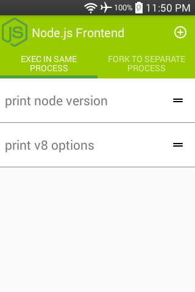
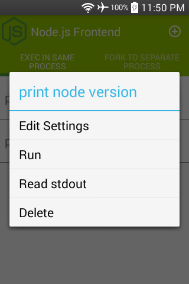
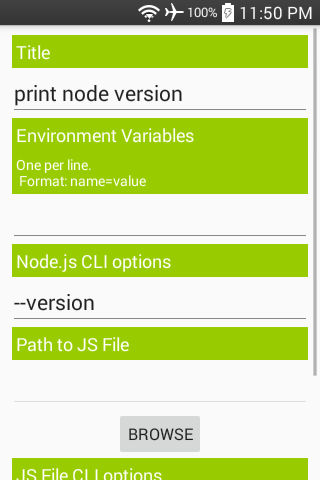
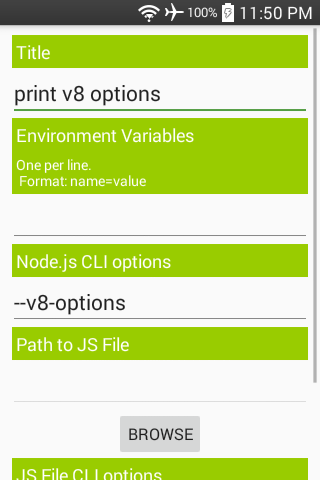
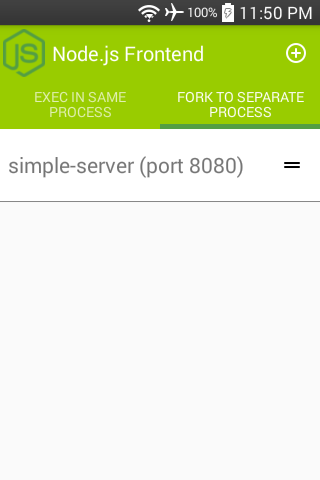
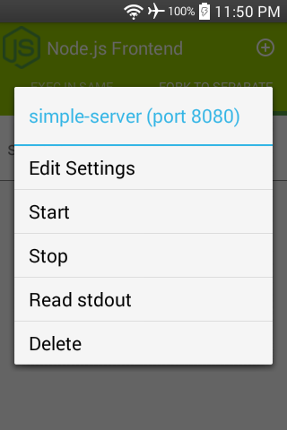
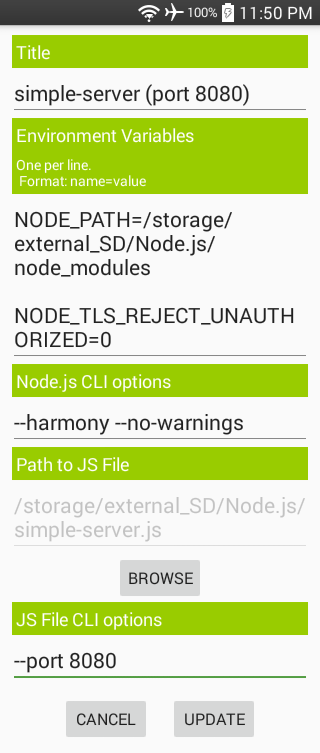
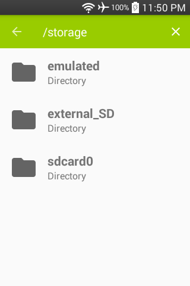

### [Node.js Frontend](https://github.com/warren-bank/Android-NodeJS-Frontend)

Android app to run Javascript files from the filesystem in Node.js

#### Screenshots:

#### Credits:

* [Node.js for Mobile Apps](https://github.com/JaneaSystems/nodejs-mobile) by [Janea Systems](https://github.com/JaneaSystems)
  * [PR#291](https://github.com/JaneaSystems/nodejs-mobile/pull/291) by [Informatic](https://github.com/Informatic/nodejs-mobile/tree/v0.3.2-support-api19) to decrease the Android minSDK from 21 to 19 for 32-bit architectures

#### Technical Details:

* Node.js for Mobile Apps
  * version: 0.3.2
  * binaries: [nodejs-mobile-v0.3.2-support-api19-android.zip](https://github.com/warren-bank/nodejs-mobile/releases/download/nodejs-mobile-v0.3.2-support-api19/nodejs-mobile-v0.3.2-support-api19-android.zip)
  * minSDK:
    * 32-bit: [19](https://github.com/warren-bank/nodejs-mobile/blob/nodejs-mobile-v0.3.2-support-api19/tools/android_build.sh#L49)
    * 64-bit: [21](https://github.com/warren-bank/nodejs-mobile/blob/nodejs-mobile-v0.3.2-support-api19/tools/android_build.sh#L50)
  * versions:
    * Node.js = 12.19.0
    * OpenSSL = 1.1.1g
* no root

#### List of Permissions:

* used by frontend
  * `android.permission.READ_EXTERNAL_STORAGE`
    * to read Javascript files from the filesystem
  * `android.permission.FOREGROUND_SERVICE`
    * to run each daemon in a separate background process
  * `android.permission.WAKE_LOCK`
    * to lock resources (cpu, wifi) in an active state while daemon(s) run

* not used by frontend; reserved for use by Javascript files
  * `android.permission.INTERNET`
  * `android.permission.WRITE_EXTERNAL_STORAGE`

#### Legal:

* copyright: [Warren Bank](https://github.com/warren-bank)
* license: [GPL-2.0](https://www.gnu.org/licenses/old-licenses/gpl-2.0.txt)
