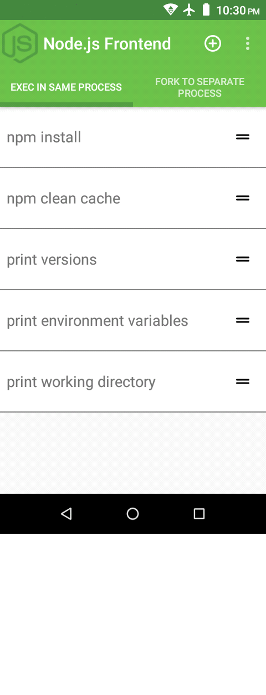

### [Node.js Frontend](https://github.com/warren-bank/Android-NodeJS-Frontend/tree/node-v18.20.4/app)

Android app to run Javascript files from the filesystem in Node.js

#### Screenshots:

#### Credits:

* _Node.js for Mobile Apps_
  * [originally](https://github.com/JaneaSystems/nodejs-mobile) by [Janea Systems](https://github.com/JaneaSystems)
  * [maintained](https://github.com/nodejs-mobile/nodejs-mobile) by [André Staltz](https://github.com/staltz)

#### Technical Details:

* _Node.js for Mobile Apps_
  * version: [18.20.4](https://github.com/nodejs-mobile/nodejs-mobile/releases/tag/v18.20.4)
  * binaries: [nodejs-mobile-v18.20.4-android.zip](https://github.com/nodejs-mobile/nodejs-mobile/releases/download/v18.20.4/nodejs-mobile-v18.20.4-android.zip)
  * minSDK: [24](https://github.com/nodejs-mobile/nodejs-mobile/blob/v18.20.4/.github/workflows/build-mobile.yml#L12)
  * versions:
    * Node.js = 18.20.4
    * OpenSSL = 3.0.13+quic
* no root

#### List of Permissions:

* used by frontend
  * `android.permission.READ_EXTERNAL_STORAGE`
    * to read Javascript files from the filesystem
  * `android.permission.FOREGROUND_SERVICE`
    * to run each daemon in a separate background process
  * `android.permission.WAKE_LOCK`
    * to lock resources (cpu, wifi) in an active state while daemon(s) run

* not used by frontend; reserved for use by Javascript files
  * `android.permission.INTERNET`
  * `android.permission.WRITE_EXTERNAL_STORAGE`

#### Recipes:

* the [recipes branch](https://github.com/warren-bank/Android-NodeJS-Frontend/tree/node-v18.20.4/recipes) contains a set of bash scripts that can be used to easily install and configure a curated selection of Node.js applications
  * the apps illustrated in the [screenshots animation](#screenshots) are included

#### Legal:

* copyright: [Warren Bank](https://github.com/warren-bank)
* license: [GPL-2.0](https://www.gnu.org/licenses/old-licenses/gpl-2.0.txt)
